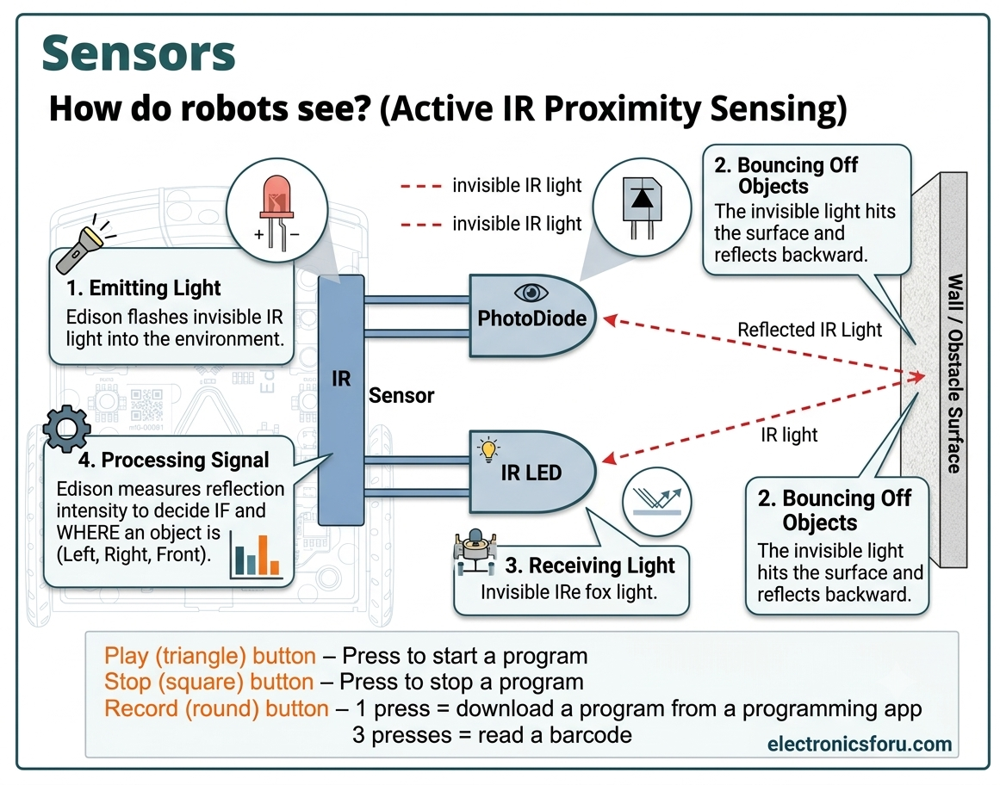

# Teaching Note: Edison Robot - Barcodes vs. EdScratch (Obstacle Avoidance)

**Class Prompt / Hook:**  
*Class, do you remember our barcodes from Week 1? Today, we are going to learn about the actual program behind those barcodes, starting with obstacle avoidance!*

---

## Overview

When we scanned the "Obstacle Avoidance" barcode in Week 1, Edison executed a pre-programmed script stored directly inside its internal firmware. In EdScratch, we write the step-by-step logic ourselves to achieve the same movement.

What is a obstacles robot?

Well, our ediion V3 can tell when there are things in front of it.
It is a robot uses infrared light to detect objects. You cannot see the light because infrared light is invisible to people's eyes.

Edison uses infrared light to find things in its path if there is something in front of Edison. Edison can turn away and avoid running into it.
---

## Comparison Summary

| Feature | Barcode Scanning ("Obstacle Avoidance") | Custom Coding in EdScratch |
| :--- | :--- | :--- |
| **How It Works** | Reads a fixed sequence stored in Edison's firmware. | Downloads your step-by-step block code via the USB cable. |
| **Sensor Setup** | Automatically enables infrared (IR) emitters and receivers. | Requires turning on IR detection explicitly using setup blocks. |
| **Control & Customization** | None. Edison moves, detects, turns, and continues on a pre-set loop. | High. You decide how far to turn, how fast to drive, or whether to sound an alarm. |
| **Logic Structure** | Hidden "black box" algorithm. | Explicit loop structure using `forever`, `if...then` blocks, and `obstacle detected` events. |

---

## Key Discussion Points for Students

1. **Barcode (Pre-made Shortcut):**  
   The barcode tells Edison to run a hidden, built-in program. Edison does the thinking for us.

2. **EdScratch (Programmer Control):**  
   In EdScratch, **you** are the programmer. You control the exact sensing, decision-making, and physical reaction when Edison encounters an obstacle.

---

## What does a IR sensor do?

They are all very different things however they use the same principle: sending a signal, bouncing it off something and listening for the echo

Bats: They emit high-pitched ultrasonic chirps that bounce off obstacles and prey, listening for the returning echo (echolocation) to calculate distance and location.

Dolphins: They release clicking sounds that travel through the water, bounce off objects or other marine life, and bounce back to their lower jaw to form an acoustic map.

Radar: It sends out radio waves or microwaves into the air, measures the time it takes for those waves to hit an object and bounce back, and determines the object's speed and position.

## How do robots see

Our Edison uses something called "Infrared (IR) light". It has an "emitter" (IR LED in the slide) that sends the light out and when it bounces off something the "receiver" (PhotoDiode on the slide) detects that and Edison thinks an obstacle has been detected.

### Edison V3 Hardware Mapping: How Robots "See"

| Conceptual Diagram Component | Edison V3 Physical Component | How It Works on Edison V3 |
| :--- | :--- | :--- |
| **IR LED** *(Emitter)* | **Left & Right Infrared LEDs** *(Front outer edges)* | Emits invisible infrared light forward into the environment. Edison pulses these LEDs to search for obstacles. |
| **Object / Obstacle** | Wall, hand, box, or track barrier | The physical surface directly in front of Edison that bounces the transmitted IR light back toward the sensors. |
| **PhotoDiode** *(Receiver)* | **Left & Right Light Sensors** *(Front inner corners)* | Detects and measures the strength of the returning reflected IR light. |
| **IR Sensor** *(Controller)* | **Edison Microcontroller Board** | Reads the sensor input to determine **if** an object is ahead and **which side** (left, right, or straight ahead) it is on. |

---

#### Step-by-Step Sensing Process

1. **Emitting Light:** Edison flashes its **Infrared LEDs** forward.
2. **Bouncing Off Objects:** Invisible light hits an obstacle surface and reflects back.
3. **Receiving Light:** The **Light Sensors** (acting as photodiodes) catch the reflected IR signal.
4. **Processing Signal:** The **Microcontroller** determines the reflection intensity. If it exceeds the threshold, EdScratch triggers the `obstacle detected` block (allowing Edison to stop, turn, or play a sound).

**"How does a robot 'sees' without actual eyes? It works just like a bat using echolocation, but with invisible light!**

1. **Flash:** Edison fires out an invisible beam of light from its front IR LEDs—like a secret flashlight beam you can't see.

2. **Bounce:** When that beam hits an obstacle, it bounces right off.

3. **Catch:** Edison's light sensors act as the receivers, catching the light as it bounces back.

4. **Think:** Edison's brain measures how strong that reflection is. High reflection? Obstacle close! Low reflection? Clear path ahead!

**So, when you write your EdScratch code today, you aren't just turning motors—you're telling Edison's brain what to do when it catches that bouncing light!"**

** What are the lights and when they are for?

**Infrared (IR) Light & Sensor (Obstacle Detection)**

* **IR Light:** Invisible light emitted forward by the robot's front LEDs.
* **IR Sensor:** Listens for the emitted IR light to bounce off an object and return (like an invisible radar).
* **When used:** Actively running during obstacle detection and seeking programs to spot objects in the robot's path.

**Normal (Visible) Light & Sensor (Line Tracking / Status)**

* **Visible Light:** Standard visible light (like the red LED underneath the robot or status lights on top).
* **Light Sensor:** Reads visible light reflected off the floor surface.
* **When used:** Used for line-following/surface detection (dark lines absorb light; white paper reflects it) and visual feedback to students.

## Teaching Sequence / Activity Steps

1. **Review Week 1:** Ask students to recall how Edison reacted when scanning the "Obstacle Avoidance" barcode.
2. **Deconstruct the Behavior:** Ask students to list the exact physical steps Edison takes when it encounters an obstacle (e.g., *Drive forward → Detect obstacle → Stop → Backup/Turn → Resume driving*).
3. **Replicate in EdScratch:** Guide students to build the program block-by-block in EdScratch using the IR detection setup, `forever` loop, and conditional blocks.
   
